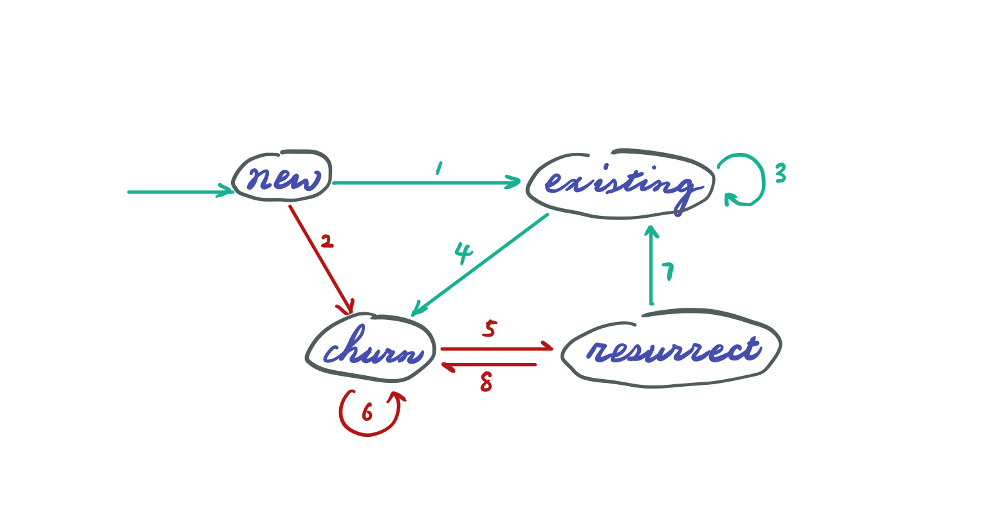

# Facebook Advertiser Status

### Key Concepts
* Conditional update with join.
* Left join vs. inner join.
* Edge case: adding new users.
* Boolean algebra and simplification.

---
### Tables:
* *DailyPay*: user_id (showing today paid ads fee) on day T. __Only__ advertisers who paid will show up in this table. 
* *Advertiser*: two columns, user_id and their status on day T-1
Use today’s payment log in *DailyPay* table to update status in *Advertiser* table

### Status: 
* New: users registered on day T.
* Existing: users who paid on day T-1 and on day T.
* Churn: users who paid on day T-1 but not on day T.
* Resurrect: users who did not pay on T-1 but paid on day T.

### State Transition

<p align="center">
    
</p>

|#| Start | End | Condition |
|-|----|----------|-----------|
|1|NEW|EXISTING|Paid on day T|
|2|NEW|CHURN|No pay on day T|
|3|EXISTING|EXISTING|Paid on day T|
|4|EXISTING|CHURN|No pay on day T|
|5|CHURN|RESURRECT|Paid on day T|
|6|CHURN|CHURN|No pay on day T|
|7|RESURRECT|EXISTING|Paid on day T|
|8|RESURRECT|CHURN|No pay on day T|

By examining the above table. We can see that as long as user has not paid on day T, his status is updated to CHURN regardless of previous status (check with interviewer that all new users who registered on day T did pay, and if they didn't, they are not immediately considered as CHURN.

When user did pay on day T (#1, 3, 5, 7). They can become either EXISTING or RESURRECT, depending on their previous state. RESURRECT is only possible when previous state is CHURN. When previous state is anything else, status is updated to EXISTING.

### Sample Database
Load the database file [db.sql](db.sql) to localhost MySQL. An Advertiser database will be created with two tables. 

```bash
mysql < db.sql -uroot -p
```

```
mysql> SELECT * FROM Advertiser;
+----+---------+-----------+
| id | user_id | status    |
+----+---------+-----------+
|  1 | bing    | NEW       |
|  2 | yahoo   | NEW       |
|  3 | alibaba | EXISTING  |
|  4 | baidu   | EXISTING  |
|  5 | target  | CHURN     |
|  6 | tesla   | CHURN     |
|  7 | morgan  | RESURRECT |
|  8 | chase   | RESURRECT |
+----+---------+-----------+
8 rows in set (0.00 sec)

mysql> SELECT * FROM DailyPay;
+----+---------+------+
| id | user_id | paid |
+----+---------+------+
|  1 | yahoo   |   45 |
|  2 | alibaba |  100 |
|  3 | target  |   13 |
|  4 | morgan  |  600 |
|  5 | fitdata |    1 |
+----+---------+------+
5 rows in set (0.00 sec)
```

---
### Solution
#### Step 1. Update Existing Advertiser
After simplifying the boolean algebra, we only need three conditions. State __explicitly__ we don't need "ELSE status" in the CASE statement because we've covered all possible conditions. Also emphasize we need __LEFT JOIN__ to find out who did not pay on day T.
```sql
UPDATE Advertiser AS a
LEFT JOIN DailyPay AS d
  ON a.user_id = d.user_id
SET a.status = CASE 
  WHEN d.paid IS NULL THEN "CHURN" 
  WHEN a.status = "CHURN" AND d.paid IS NOT NULL THEN "RESURRECT"
  WHEN a.status != "CHURN" AND d.paid IS NOT NULL THEN "EXISTING"
  END;
```

Check the *Advertiser* to see if the update make sense.
```
mysql> SELECT * FROM Advertiser;                                                
+----+---------+-----------+
| id | user_id | status    |
+----+---------+-----------+
|  1 | bing    | CHURN     |
|  2 | yahoo   | EXISTING  |
|  3 | alibaba | EXISTING  |
|  4 | baidu   | CHURN     |
|  5 | target  | RESURRECT |
|  6 | tesla   | CHURN     |
|  7 | morgan  | EXISTING  |
|  8 | chase   | CHURN     |
+----+---------+-----------+
8 rows in set (0.00 sec)
```

#### Step 2. Insert New Advertiser
Note that we missed the new user. To find the new user, left join *DailyPay* with *Advertiser*. If there is no match on the right, the user is new.

```sql
INSERT INTO 
Advertiser (user_id, status)
SELECT d.user_id
  ,"NEW" as status
FROM DailyPay AS d
LEFT JOIN Advertiser AS a
  ON d.user_id = a.user_id
WHERE a.user_id IS NULL;
```

Check again that the new users are added.
```
SELECT * FROM Advertiser;
+----+---------+-----------+
| id | user_id | status    |
+----+---------+-----------+
|  1 | bing    | CHURN     |
|  2 | yahoo   | EXISTING  |
|  3 | alibaba | EXISTING  |
|  4 | baidu   | CHURN     |
|  5 | target  | RESURRECT |
|  6 | tesla   | CHURN     |
|  7 | morgan  | EXISTING  |
|  8 | chase   | CHURN     |
|  9 | fitdata | NEW       |
+----+---------+-----------+
9 rows in set (0.00 sec)
```
See solution [here](solution.sql).