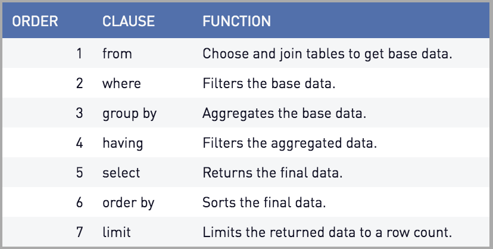

## Beyond LeetCode SQL
This repository covers supplementary analysis of SQL for LeetCode and classic interview questions, tradeoff between performance optimization and developmental efficiency, and how it relates to general database design consideration (e.g. indexing and join). Specific sample databases are provided to illustrate tricky interview questions.

---
### LeetCode Selected Probems
Only high-quality problems are selected. Pathological problems such as [Find Median Given Frequency of Numbers](https://leetcode.com/problems/find-median-given-frequency-of-numbers) are not discussed. Entry-level syntax problems such as [Combine Two Tables](https://leetcode.com/problems/combine-two-tables) are not discussed.

| \# | Problems | Solutions | Level | Concept |
|----|----------|-----------|------| --------|
| 262 | [Trips and Users](https://leetcode.com/problems/trips-and-users/) | [MySQL](./LeetCode/262_Trips_and_Users/README.md) | Hard | Three-way join; filtering |
| 185 | [Department Top Three Salaries](https://leetcode.com/problems/department-top-three-salaries) | [MySQL, MS SQL](./LeetCode/185_Department_Top_Three_Salaries/README.md) | Hard | Non-equijoin; aggregation; window functionsample |
| 579 | [Cumulative Salary of Employee](https://leetcode.com/problems/find-cumulative-salary-of-an-employee/) | [MySQL, MS SQL](./LeetCode/579_Find_Cumulative_Salary_of_an_Employee/README.md) | Hard | Self-join; left join; aggregation |
| 601 | [Human Traffic of Stadium](https://leetcode.com/problems/human-traffic-of-stadium/) | [MySQL, MS SQL](./LeetCode/601_Human_Traffic_of_Stadium/README.md) | Hard | Self-join; de-duplication; window |
| 615 | [Average Salary](https://leetcode.com/problems/average-salary-departments-vs-company/) | [MySQL](./LeetCode/615_Average_Salary/README.md) | Hard | Case; aggregation, join |
| 618 | [Students Report By Geography](https://leetcode.com/problems/students-report-by-geography/) | [MySQL, MS SQL](./LeetCode/618_Students_Report_by_Geography/README.md) | Hard | Full join, pivoting |

Other undiscussed problems have solutions lumped [here](LeetCode/others/).

---
### Classic Interview Questions
This section covers commonly tested concepts during interviews. Many notebooks are inspired by problems people who violated their confidentiality agreement and posted interview materials on Quora, Glassdoor, and 1point3acres. Data are either synthetic or from my personal challenge project.

| \# | Problems 					| Solutions 												   | Concept 										  |
|----|------------------------------|--------------------------------------------------------------|--------------------------------------------------|
| 1 | Facebook Advertiser Status 	| [MySQL](./Interview/01_Facebook_Advertiser_Status/README.md) | Transition diagram; conditional update|
| 2 | Spotify Listening History 	| [MySQL](./Interview/02_Spotify_Listening_History/README.md)  | Update cumulative sum |
| 3 | Monthly Active User 			| [MySQL](./Interview/03_Monthly_Active_User/README.md) 	   | Functional dependency; aggregation; filtering |
| 4 | Page Recommendation 			| [MySQL](./Interview/04_Page_Recommendation/README.md) 	   | Undirected edge; aggregation; existance |
| 5 | Pivoting Numeric Data 		| [MySQL](./Interview/05_Pivoting_Numeric_Data/README.md) 	   | Pivoting numeric data with case statement |
| 6 | Pivoting Text Data 			| [MySQL](./Interview/06_Pivoting_Text_Data/README.md) 		   | Pivoting text data with self-join |
| 7 | Un-pivoting Tables 			| [MySQL](./Interview/07_Unpivoting_Tables/README.md) 		   | Un-pivoting tables using cross-join |
| 8 | Group by Bins 				| [MySQL](./Interview/08_Group_by_Bins/README.md) 			   | Create custom column to group by |
| 9 | Consecutive Active Users 		| [MySQL](./Interview/09_Consecutive_Active_Users/README.md)   | Self-join, *LAG()* |
|10 | Recommend Friends 			| [MySQL](./Interview/10_Spotify_Recommend_Friend/README.md)   | Self-join, de-duplication, aggregation |
|11 | Spotify Similar Friends 		| [MySQL](./Interview/11_Spotify_Similar_Friends/README.md)    | Three-way join, de-duplication, aggregation |
|12 | Invalid Search				| [MySQL](./Interview/12_Invalid_Search/README.md)    		   | __NULL__ handling, rate calculation |
|13 | Text Confirmation				| [MySQL](./Interview/13_Text_Confirmation/README.md)          | Rate calculation |
|14 | Facebook Common Friends		| [MySQL](./Interview/14_Facebook_Common_Friend/README.md)     | self join, three-way join |
|15 | Facebook Recommend Friend		| [MySQL](./Interview/15_Facebook_Recommend_Friend/README.md)  | Self join, four-way join |
|16 | Instagram Common Follower		| [MySQL](./Interview/16_Instagram_Common_Follower/README.md)  | Self join, Directed edge |

---
### Hacks
This section covers esoteric details of SQL language and use cases that may be completely useless in interview. Nevertheless, they come handy when judgement calls and some are simply fun to explore.

| \# | Concept                          | Notebook    							  |
|----|----------------------------------|-----------------------------------------|
| 1  | Random Sampling from Groups      | [MySQL8](./Hacks/01_Random_Sampling)    |
| 2  | NULL Pathological Study          | [MySQL8](./Hacks/02_NULL_pathology)     |
| 3  | Full Join    	                | [MySQL8](./Hacks/03_Full_Join)    	  |
| 4  | Dynamic Query (Python) 		    | [MySQL8](./Hacks/04_Dynamic_Query)      |
| 5  | Stored Procedure 	            | [MySQL8](./Hacks/05_Stored_Precesure)   |
| 6  | Hacking Aggregation 	            | [MySQL8](./Hacks/06_Hacking_Aggregation)|
| 6  | Multi Column Partition 	        | [MySQL8](./Hacks/07_Multi_Column_Partition)|

___
### Table Optimization
Avoid full-table scan. Used for primary key (automatic), foreign key, commonly used columns.

* **cardinality**: the uniqueness of the data.

Index types:
* single column index
* unique index (e.g. SSN)
  - cannot create unique index on column with duplicate or **NULL** values
* composite index
  - column that get's most recently queried gets placed first
* implicit index: primary key (automatically unique)

Create index when column:
* is frequently referneced in `order by` or `group by`
* contains lots of unique values

Avoid index when column:
* in small table
* return high percentage of matching data
* require frequent batch update (drop before updating)
* contains lots of **NULL**
* gets frequently manipulated
* extremely long string

**best practice**: rebuild index frequently to reduce fragmentation

___
### Query Optimization



* Place smaller table first when joining multiple tables
* Largest table is the base table
  - base table is placed on right hand side of equal sign (where clause)
* Place most restrictive condition **last**:
  - The condition in the WHERE clause of a statement that returns the fewest rows of data
  - the most restrictive condition was listed last in the WHERE clause,
* try to use indexed column

```SQL
FROM TABLE1,   -- Smallest table
     TABLE2,   -- to
     TABLE3    -- Largest table, also base table
WHERE TABLE1.COLUMN = TABLE3.COLUMN    -- Join condition
  AND TABLE2.COLUMN = TABLE3.COLUMN    -- Join condition
[ AND CONDITION1 ]                     -- Filter condition
[ AND CONDITION2 ]                     -- Filter condition
```

* Using the `like` operator and wildcards (flexible search)
* Avoiding the `or` operator, use `in` operator
  - data retrieval is measurably faster by replac- ing OR conditions with the IN predicate
* Avoiding the `HAVING` clause
  - try to frame the restriction earlier (`where` clause)
  - try to keep `HAVING` clause simple (use constant, not function)
* avoiding large sort operations
  - it is best to schedule queries with large sorts as periodic batch processes during off-peak database usage so that the performance of most user processes is not affected.
* Prefer stored procedure
  - compiled and permanently stored in the database in an executable format.
* Disabling indexes during batch loads
  - When the batch load is complete, you should rebuild the indexes.
  - reduction of fragmentation that is found in the index
* cost-based optimization: check database server manual
* Using view: keep the levels of code in your query as flat as possible and to test and tune the statements that make up your views

___
### Formatting for Readability
* Always begin a new line with each clause in the statement. For example, place the FROM clause on a separate line from the SELECT clause. Then place the WHERE clause on a separate line from the FROM clause, and so on.

* Use tabs or spaces for indentation when arguments of a clause in the statement exceed one line.

* Use tabs and spaces consistently.

* Use table aliases when multiple tables are used in the statement. The use of the full table name to qualify each column in the state- ment quickly clutters the statement and makes reading it difficult.

* Use remarks sparingly in SQL statements if they are available with- in your specific implementation. Remarks are great for documenta- tion, but too many of them clutter a statement.

* Begin a new line with each column name in the SELECT clause if many columns are being selected.

* Begin a new line with each table name in the FROM clause if many tables are being used.

* Begin a new line with each condition of the WHERE clause. You can easily see all conditions of the statement and the order in which they are used.

---
### Anti-patterns
This section *WILL* discusses common pitfalls such as nested selects, redundant temporary tables, unnecessary cross join, unnecessary hashset using distinct key word.

| \# | Anti-patterns                    | Notebook    							  					  |
|----|----------------------------------|-------------------------------------------------------------|
| 1  | Ambiguous Group 			        | [MySQL8](./Anti_Patterns/01_Ambiguous_Group)                |
| 2  | Bad Subquery 		            | [MySQL8](./Anti_Patterns/02_Bad_Subquery)  				  |
| 3  | Fail to Use Index                | [MySQL8](./Anti_Patterns/03_Fail_to_Use_Index) 			  |
